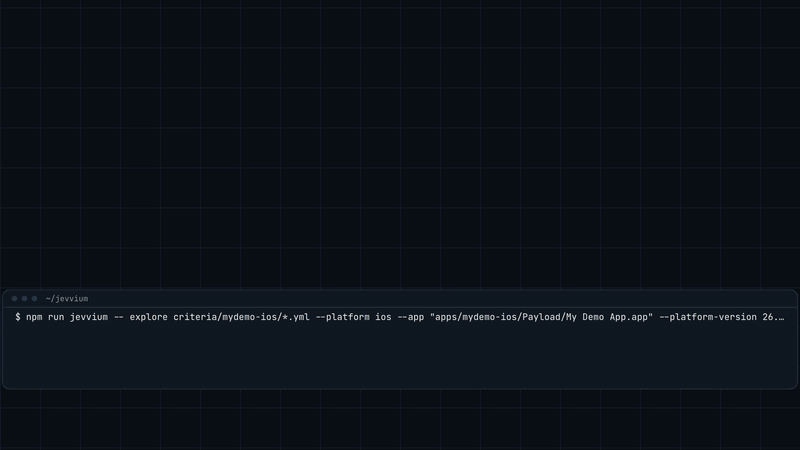

# jevvium

[](https://github.com/AndresCarreonDiaz/jevvium/actions/workflows/ci.yml)

**Turn acceptance criteria into Appium tests.** You describe the behaviour a new feature should have. A decision model finds the path through the app, one tap at a time. jevvium writes that path down as a plain WebdriverIO test, with fixed selectors and real assertions, replays it once with plain Appium to prove it passes on its own, and hands it over to run in CI with no AI in the loop.



Five acceptance criteria of a real shop app, explored on four iOS Simulators at once in 22.0 s, played here at 2x. Four passed and became tests; the fifth stopped on a real bug in the app. The run's traces are in [`benchmarks/2026-09-29-parallel`](benchmarks/2026-09-29-parallel/four-simulators-video).

```yaml
# criteria/login.yml
goal: A registered user logs in with a valid email and password and is told they are logged in.
inputs:
  email: qa.demo@example.com
  password: Str0ngPassw0rd
expect:
  - text: You are logged in!
```

```
$ npx jevvium explore criteria/login.yml --app apps/wdiodemoapp.app
Simulator: iPhone 17, iOS 26.5
Starting Appium (log: runs/appium.log)

login: A registered user logs in with a valid email and password and is told they are logged in.
(input: direct to the simulator)
   1  tap "Login"                             0.90 · 183 ms
   2  type email → "Email"                    0.89 · 190 ms
      type password → "Password"
   3  tap "LOGIN"                             0.90 · 101 ms
   4  goal reached                            goal 0.96 · 114 ms
  PASSED in 5.5s: Goal reached and all 1 expectations hold.
  replayed with plain Appium in 5.3s: passed
```

Each line is one decision: what it did, how sure the model was, and how long the model took to answer. The second decision filled both fields. The test it wrote:

```ts
// examples/ios/login.ios.spec.ts, generated by jevvium with jev-1.13.0
describe('login', () => {
  it('A registered user logs in with a valid email and password and is told they are logged in.', async () => {
    await $('~Login').click()
    await $('~input-email').setValue('qa.demo@example.com')
    await $('~input-password').setValue('Str0ngPassw0rd')
    await $('~button-LOGIN').click()
    await expect($('-ios predicate string:label == "You are logged in!"')).toBeDisplayed()
  })
})
```

## Why

When a feature ships, someone has to work out which screens to go through, which elements to use and in what order, and then write that down as a test. AI agents that drive the app can do the working out, but running one on every CI build is slow, costs money on every run, and doesn't give the same result twice.

jevvium splits the job in two:

1. **Explore once.** A decision model picks each next action from the elements that are actually on screen, until the goal is reached.
2. **Run forever.** The path it found becomes an ordinary test. You review it, commit it, and CI runs it like any other test.

## How it works

```
criteria.yml ──► explore loop ──────────────────────────► replay with plain Appium ──► generated spec ──► CI
                   │                                       (proves the steps pass)      (plain WebdriverIO)
                   ├─ read the screen
                   ├─ list what can be done: tap each button, type each input into each field
                   ├─ ask the model: which action next? is the goal reached? what goes in each empty field?
                   ├─ stop and escalate if its confidence is low
                   └─ act, wait for the screen to settle, repeat
```

Each step is usually one request to [Jev](https://docs.typesafe.ai), TypeSafe's decision model. Jev doesn't write text: it picks one option from a list you give it and says how sure it is. That fits this problem well:

- **It can only pick elements that exist.** The options are built from the page source, so there is no invented selector to debug.
- **It says how sure it is.** When its confidence drops below `--min-confidence`, jevvium stops and reports the step as `escalated` instead of tapping something at random. TypeSafe trains Jev for calibrated probabilities; jevvium hasn't measured how well that holds for this step confidence yet.
- **One request answers every question.** "What next?", "Is the goal reached?" and "Which test data goes in each empty field?" go out together and Jev answers them in parallel, so a whole form is filled from one decision.
- **It is fast and cheap.** Asked the same questions as Claude Sonnet 5.5 on the same criteria, it passed 21 of 27 runs to Sonnet's 22, with a median decision of 125 ms against 1.8 s, at $0.071 per 1,000 requests against $5.53 at list prices ([comparison](#jev-against-claude-sonnet-55)).

Pass or fail comes from the `expect` checks, not from the model: when the model thinks the goal is reached, jevvium checks them against the device, and the run only passes if all of them hold. A criterion without `expect` entries passes on the model's word, and its generated test says so.

## Tried on a real shop app

Sauce Labs publishes [My Demo App](https://github.com/saucelabs/my-demo-app-ios), a shop built to practice test automation on: a catalog, product pages, a cart, and a checkout behind a login with shipping and card forms. Five criteria for it are in [`criteria/mydemo-ios`](criteria/mydemo-ios), and the traces and tests from this run are in [`examples/ios-mydemo`](examples/ios-mydemo) (iOS 26.5 simulator, `jev-1.13.0`):

| Criterion | Outcome | Decisions | Exploring | Replay with plain Appium |
| --- | --- | --- | --- | --- |
| Add a backpack to the cart | passed | 4 | 2.8 s | passed, 2.4 s |
| Add two backpacks, check the total | passed | 7 | 5.4 s | passed, 4.6 s |
| Shipping without a zip code is refused | passed | 9 | 8.2 s | failed (see below) |
| Buy a backpack: login, shipping and card forms, place the order | passed | 12 | 12.5 s | failed (see below) |
| Sort the catalog by price, low to high | stuck | 4 | 3.3 s | |

Two of these found real problems in the app:

- **Sorting by price.** After "Price - Ascending", the cheapest product is not at the top. The app compares prices as text, so $7.99 sorts after $49.99. The model can't see prices (they are all labelled "Product Price"), so it was unsure the goal was reached; the `expect` check is what caught it: "1 of 1 expectations do not hold."
- **The on-screen keyboard.** jevvium's simulator input types like a hardware keyboard, so during exploration the on-screen keyboard never appears and both form flows pass. The replay types through XCTest, which raises the on-screen keyboard, and this app never closes it: it covers "To Payment", and nothing on the screen scrolls or dismisses it. On a phone without a hardware keyboard, "To Payment" would stay hidden behind the keyboard. The replay check reports this instead of handing over a test that can't pass, and the generated spec starts with a warning saying so.

To run them: `npm run apps:mydemo` downloads the app from Sauce Labs' release (it isn't redistributed here; its build includes Sauce's beta-testing SDK, which may send session data to Sauce Labs, so the criteria use made-up data only), then `npm run jevvium -- explore criteria/mydemo-ios/*.yml --app "apps/mydemo-ios/Payload/My Demo App.app" --max-steps 20`.

## Speed

Every step costs a screen read, a decision and an action. On an iOS Simulator jevvium cuts all three:

| Part | How | Cost |
| --- | --- | --- |
| Acting | A native helper sends touches and key presses straight into the simulator, skipping XCTest | about 25 ms per tap, instead of about 400 ms |
| Reading | A page source without XCTest's `visible` attribute is about 3x faster. Visibility is worked out from positions, and XCTest confirms each element right before it is used. Sheets, popovers and screens spread over several windows get the full read. Positions can't show a view the app keeps on screen but hidden, so its text can reach the model; a goal claimed on such a read is judged again on a full read before the run is called a failure | 80 to 140 ms, instead of 250 to 450 ms |
| Deciding | Jev usually answers in 100 to 250 ms. The first request of a step goes out while jevvium checks that the screen has settled, which hides most of that time | |
| Forms | One decision fills every field the model is sure about | one step instead of one per field |
| Between criteria | One Appium session for the whole run, with the app restarted through `simctl` | about 2 s, instead of a new session |

The same four criteria on the same machine, the version before these changes against the current one, one run after the other ([traces](benchmarks/2026-09-29-ios-demo-app)):

| Criterion | Before | After |
| --- | --- | --- |
| login | 10.6 s | 4.7 s |
| login-invalid-email | 12.0 s | 3.6 s |
| forms-switch | 4.6 s | 2.6 s |
| signup (stuck in both, see Status) | 20.5 s | 5.4 s |
| **Exploring, all four** | **47.7 s** | **16.3 s** |
| **Wall clock, as timed by the shell** | **66 s** | **28 s** |

Both runs explored only. The replay check is extra: for these criteria it added about 4 to 7 s each (an app restart of about 2 s, then a 2 to 5 s replay). None of this reaches the generated tests. They are plain WebdriverIO and run anywhere Appium does.

### Several simulators at once

`--parallel <n>` explores up to n criteria at the same time, each on its own simulator with its own Appium server, since one server starts one session at a time. The first time, it creates simulators named like "jevvium 2 (iPhone 17)", of the same model and iOS version as `--device`, and boots them; they stay for later runs. A lane that can't start a session hands its criteria to the others. Sessions launch the WebDriverAgent that Appium already built instead of running xcodebuild again, so all of them are ready in about 6 s.

The five shop-app criteria, exploring only (`--no-verify`), wall clock including the sessions starting ([traces](benchmarks/2026-09-29-parallel)):

| | One simulator | Four simulators |
| --- | --- | --- |
| First run | 42.1 s | 21.7 s |
| Second run | 49.8 s | 21.1 s |

All four runs passed the same four criteria and stopped on the sorting bug. With four at once, the longest criterion (the full checkout, 12 decisions) sets the time.

### The native helper

[`native/ios-hid`](native/ios-hid/main.m) is a small Objective-C program that jevvium compiles with your Xcode the first time it runs against a simulator, and caches in `~/Library/Caches/jevvium`. It builds touches with the same SimulatorKit function the Simulator app uses for a mouse click, sends them over SimulatorKit's HID port, and sends key presses to the simulator's `dtuhidd` service over XPC. It is an Objective-C port of the approach used by Meta's [idb](https://github.com/facebook/idb): its single-finger touch message and its dtuhidd keyboard transport. Those portions are derived from idb and covered by its MIT license, reproduced in [`native/ios-hid/NOTICE`](native/ios-hid/NOTICE).

What to know about it:

- It relies on Apple's private SimulatorKit, CoreSimulator and libxpc interfaces, which can change with any Xcode or macOS release. It has been tested with Xcode 27.0 and the iOS 26.5 runtime. Its fallback for older Xcodes, where key presses go over the HID port, is untested.
- It types US keyboard key codes. On a simulator whose hardware keyboard layout isn't US, other characters come out; use `--input appium` there.
- It tells the simulator a hardware keyboard is connected, like the Simulator app's Connect Hardware Keyboard option, and types like one, so the on-screen keyboard stays out of the way while exploring, on every simulator alike. The generated tests type through XCTest, which does raise it. The replay check catches an app where that difference matters (see the shop app above).
- Its touches and key presses reach the app a moment after they are sent, later on a busy machine, and on separate channels. So before typing into a field, jevvium waits until XCTest reports that field has keyboard focus (about 50 ms), and after each action it waits up to 1 s for the screen to change before reading it again, not counting numbers that tick on their own, such as a countdown. An action that changes nothing costs that second.
- Its input doesn't always arrive. On the iOS 27.0 simulator, the first tap of a session has been lost in every run so far, and twice, after a long day of experiments, an iOS 26.5 simulator stopped reacting to its touches until it was rebooted. So jevvium checks: when the model picks the same tap again on a screen that didn't change, that tap and every later one go through Appium, and typed text is read back and typed again through XCTest if it came out wrong. Each switch is noted under its step.
- Appium still does the input where the helper can't do it safely: an element that has moved off screen or under the keyboard (XCTest scrolls it into view), text that isn't plain ASCII, and typing when the simulator's keyboard service didn't answer.
- On a real device, or when the helper can't be built or can't connect, jevvium uses Appium for all input and says so. `--input appium` turns the helper off.

## Guardrails

| Risk | What jevvium does |
| --- | --- |
| The model is guessing | Stops below `--min-confidence` and marks the run `escalated` |
| The model is wrong about success | Pass or fail comes from the `expect` checks when the criterion has them |
| The model is unsure it succeeded | When a run stops after taking at least one action, the `expect` checks run anyway, so an unsure model can't turn a pass into a fail. If they don't hold, the trace says which |
| The generated test wouldn't pass on its own | Every pass is replayed once with plain Appium before its test is written (unless `--no-verify`). A failed replay is reported, counts as a failure, and puts a warning at the top of the spec |
| State the text doesn't show | Switch states (on or off) are sent along with the visible text, and fields are named after the caption above them, not only their placeholder |
| It goes round in circles | Stops when the same action is chosen 3 times on an unchanged screen, and after `--max-steps` decisions |
| The screen is still loading | Waits until the page source stops changing and no spinner is on screen, and after direct input, until the screen has changed |
| A fast read misses what covers an element | XCTest confirms each element right before it is used. A covered one is left out until the screen changes, and the model decides again. The run stops after 6 covered choices in a row |
| Keys land in the wrong field | Direct typing starts only once XCTest reports the tapped field has keyboard focus; otherwise XCTest types it |
| Direct input doesn't reach the app | Typed text is read back and typed again through XCTest if it is wrong. A tap the model has to pick twice on an unchanged screen goes through Appium, and so do the ones after it |
| Test data leaks | Test data values are replaced with `{name}` in what is sent to the model and what traces store (details under "What gets sent to the decision model") |

## Quick start

You need macOS with Xcode and an iOS simulator, Node 22.13 or later (or 24), and a Jev key (see [Getting a key](#getting-a-key)). In the project your tests live in:

```bash
npm i -D jevvium
npx jevvium init        # a starter criterion, a .env for the key, .gitignore entries
# put your key in .env, and describe a flow of your app in criteria/example.yml
npx jevvium explore criteria/example.yml --app path/to/YourApp.app
npx jevvium test --app path/to/YourApp.app
```

`explore` writes each passing test to `generated/`, and `test` runs them with WebdriverIO. Both start their own Appium server, so there is nothing else to run. The first session on a simulator builds WebDriverAgent with Xcode, which takes a few minutes, once. Android is experimental: its parser is unit-tested on a hand-written page source and it hasn't run on an emulator yet.

| Command | What it does |
| --- | --- |
| `jevvium init` | Writes `criteria/example.yml`, a `.env` for the key and `.gitignore` entries |
| `jevvium validate <criteria...>` | Checks criteria files, without a device or a key |
| `jevvium explore <criteria...> --app <path>` | Explores each criterion, replays the path with plain Appium, and writes its test |
| `jevvium test [specs...] --app <path>` | Runs the generated tests (default: every one in `generated/`) |
| `jevvium codegen <trace> --criteria <file>` | Writes the test for an earlier run's trace |

`npx jevvium --help` lists every option.

### Your own app

`--app` takes an iOS app built for the simulator: a `.app`, or an `.ipa` or `.zip` holding one. A build for devices, from an archive, TestFlight or most CI pipelines, won't run on a simulator, and jevvium says so before anything starts. To build one for the simulator:

```bash
xcodebuild -scheme YourScheme -sdk iphonesimulator -configuration Debug -derivedDataPath build build
npx jevvium explore criteria/example.yml --app build/Build/Products/Debug-iphonesimulator/YourApp.app
```

Running the app on a simulator from Xcode leaves the same `.app` in `~/Library/Developer/Xcode/DerivedData/YourApp-*/Build/Products/Debug-iphonesimulator/`. An app that is already installed on the simulator can be explored with `--bundle-id com.example.YourApp` instead.

jevvium uses the plain iPhone with the highest number on the newest simulator runtime your Xcode has, and says which. `--device "iPhone 17" --platform-version 26.5` picks another (`xcrun simctl list devices available` lists them; the runs in this README used iOS 26.5). Several criteria can be passed at once: they share one Appium session and the app is restarted between them (`--fresh-session` starts a new session for each instead), or `--parallel 4` explores four at a time on four simulators.

### Getting a key

Jev needs a TypeSafe account and an API key from [console.typesafe.ai](https://console.typesafe.ai). Exploring the nine criteria once costs about half a cent: at TypeSafe's published price of $0.042 per million input tokens (output tokens are free), the four demo-app criteria used about 19,000 input tokens (under $0.001) and the five shop-app criteria about 104,000 (about $0.004). `TYPESAFE_API_URL` points jevvium at another endpoint that serves TypeSafe's API, and `JEVVIUM_MODEL` picks the model.

### Trying it on the demo apps

The criteria in this repo are written for two public demo apps. From a clone:

```bash
npm ci
npm run apps                   # downloads the pinned WebdriverIO demo app builds
npm run jevvium -- explore criteria/login.yml --app apps/wdiodemoapp.app
```

The generated tests need no key and no model. This runs one of the committed examples on the newest simulator runtime your Xcode has (it passes on iOS 26.5 and 27.0):

```bash
npx wdio run config/wdio.ios.conf.ts --spec examples/ios/login.ios.spec.ts
```

## Writing criteria

| Field | Required | Meaning |
| --- | --- | --- |
| `goal` | yes | The behaviour to reach, written the way you'd write an acceptance criterion |
| `inputs` | no | Test data the flow may type, by name. The model sees the names, not the values |
| `expect` | strongly recommended | Checks that must hold at the end: `id` (accessibility id) or `text` (visible text) |
| `id` | no | Name of the generated test. Defaults to the file name |

A criterion without `expect` can still pass, but only on the model's word, and the generated test gets a TODO where the assertion should be.

Write the goal the way a good acceptance criterion reads: say where the feature lives when it isn't reachable in an obvious way from the first screen ("On the Login screen, a new user switches to the Sign up form..."). jevvium doesn't backtrack yet, so a wrong first turn ends the run. Test data must not equal a field's placeholder, because a field showing its placeholder counts as empty.

## Outcomes

| Outcome | Meaning | Test written? |
| --- | --- | --- |
| `passed` | Goal reached and every expectation holds | yes, after the replay check |
| `failed` | The model thought the goal was reached, but an expectation doesn't hold. Often a real bug | no |
| `escalated` | Confidence dropped below the threshold. A person should look at that step | no |
| `stuck` | No action moves toward the goal, or it was repeating itself | no |
| `gave-up` | `--max-steps` reached | no |
| `error` | Something broke mid-run (the device, the helper, the provider); the reason says what | no |

Every run that gets as far as exploring writes a trace (one whose session or app restart fails first writes none) with, for each step, the visible text, how many actions were offered, the decision (choice, confidence, the five most likely options, the goal probability, the field answers, the model and its latency), and what was done. It also records the replay result, and how many requests were made and the tokens they used, counting those whose answers were thrown away because the screen was still changing or the chosen element was covered.

## Using it as a library

The explorer only needs a small `Device` interface, so it runs inside an existing WebdriverIO session:

```ts
import { explore, webdriverDevice, JevProvider, generateSpec, loadCriterion } from 'jevvium'

const criterion = loadCriterion('criteria/login.yml')
const trace = await explore(webdriverDevice(browser), criterion, { provider: new JevProvider() })
if (trace.outcome === 'passed') console.log(generateSpec(trace, criterion))
```

A different model can be plugged in by implementing `DecisionProvider`.

## Comparing decision models

`--provider openai` explores with OpenAI's Decisions API (GPT-6 Luna) instead of Jev. OpenAI announced it at DevDay on September 29, 2026, in limited preview, and hasn't published its API reference yet, so the request follows calls an early tester recorded against the live API; expect to adjust it once the reference is out. It needs an `OPENAI_API_KEY` from an organization with preview access, in `.env` next to the TypeSafe key. It is asked what Jev is asked, in the same words; the only difference is the API's own: its yes/no question takes no descriptions of the answers, so Jev's descriptions of "goal reached" are part of that question's wording.

`--provider claude` explores with Claude through the Claude Code CLI, signed in with a Claude subscription instead of an API key, which makes it a way to compare models rather than a way to run jevvium. Each decision runs `claude -p` once (once more if the reply isn't a usable answer), with no tools and no prompt caching, asks what Jev is asked, in the same words, and reads the answers back as JSON. `CLAUDE_MODEL` picks the model (default: `sonnet`), and the effort is medium. The CLI adds about 0.2 s to each decision to start, and about 445 tokens of its own to each request. It turns thinking off where it can, but not for Sonnet 5.5, which decides for itself when to think, so the benchmark reports how often it did.

`npm run benchmark -- --providers jev,openai,claude-sonnet --repeat 3` runs both suites with each provider and writes a table. It skips a provider whose key isn't set, or Claude when the CLI isn't installed. The table has:

- runs passed. Runs that broke, on the device or the network, are counted apart; a run where the model never gave a usable answer counts as not passed.
- decisions kept, requests and exploring time per passed run, over the criteria every provider passed.
- decision latency, median and 90th percentile.
- input tokens per request, and cost per 1,000 requests at list prices.
- a Brier score for the "goal reached" probability in every run whose expectations were checked, a measure of how well that probability is calibrated.

It doesn't score the step confidence that `--min-confidence` uses. A round that breaks or is interrupted runs again the next time.

### Jev against Claude Sonnet 5.5

Both suites, three rounds each, on one iOS 26.5 simulator, exploring only. Sonnet ran through the Claude Code CLI as described above, at medium effort. The [traces and the script's own table](benchmarks/2026-09-29-jev-vs-claude-sonnet) are in the repo.

| | Jev (`jev-1.13.0`) | Claude Sonnet 5.5 |
| --- | --- | --- |
| Runs passed | 21 of 27 | 22 of 27 |
| Decisions per passed run * | 6.1 | 6.2 |
| Exploring time per passed run * | 5.9 s | 21.7 s |
| Decision latency, median | 125 ms | 1,814 ms |
| Decision latency, 90th percentile | 186 ms | 2,516 ms |
| Cost per 1,000 requests, at list prices | $0.071 | $5.53 |
| "Goal reached" Brier score (lower is better) | 0.009 | 0.016 |

\* Over the 7 criteria both passed, averaged per criterion.

- **Mostly the same paths.** On those 7 criteria both models passed every round, and Sonnet took Jev's steps in 18 of its 21 runs. In the other 3 it typed the password a second time (login), tapped a color before adding the first backpack (two backpacks), and typed the `password` test data into the Email field (invalid email), which passed because a password isn't a valid email address either. Almost all of the extra time is spent waiting for Sonnet's answers, CLI start-up included.
- **One extra pass for Sonnet.** On signup (see Status), Sonnet once read the validation errors, typed the password again and signed up, thinking before each of those steps. In the other two rounds it stopped at the errors, as Jev did in all three. It had thought on its first look at the errors in those rounds too, but jevvium threw that answer away because the screen was still changing, and its answer once the screen settled, given without thinking, was to stop.
- **Jev took the same steps every round.** Sonnet's steps varied on 5 of the 9 criteria, and on the sorting bug it ended `failed` once and `stuck` twice.
- **Jev's better Brier score comes from the sorting bug.** On the sorted catalog, where neither model can see the prices, Sonnet put 0.6 to 0.8 on "goal reached" and Jev about 0.3. Without that criterion, Sonnet's goal probabilities score better than Jev's: 0.001 against 0.007.

The CLI costs Sonnet some time and money:
- Its API time alone had a median of 1,600 ms.
- The tokens the CLI adds account for about $0.89 of its $5.53, so an API client would pay about $4.64 per 1,000 requests, still about 65 times Jev's $0.071.

Also:
- Sonnet thought before 25 of its 224 answers, counting those jevvium threw away.
- Its confidence is its own estimate, while Jev computes its confidence from its probabilities.
- List prices: Jev $0.042 per million input tokens, with output free; Sonnet 5.5 $2 per million input tokens and $10 per million output tokens.

## What gets sent to the decision model

The same goes to TypeSafe, or with `--provider openai` to OpenAI, or with `--provider claude` to Anthropic, together with what Claude Code adds to every prompt. For each step: the platform, the goal, the text on screen (see Reading under Speed for what a fast read can include), the on/off state of switches, a description of each available action (the element's label or caption, its placeholder, its accessibility id and rough position), the steps already taken, the names of the inputs, and one question per empty field asking which input belongs in it. Screenshots, selectors, input values and expectations are never sent.

Before anything is sent or stored, each test data value is replaced with `{name}`: matching ignores case, a value written as a number also matches when the app groups its digits with spaces, dots, slashes, dashes or parentheses (the way card numbers, phone numbers and dates are shown), and a value shorter than 3 characters is replaced only where it stands alone and in its exact case. Even so, a short value hides the same word anywhere it appears, goal included (a state `OK` hides an OK button), so prefer longer made-up values. The goal, the expectations and the reason a run stopped get the same treatment when stored in a trace. In selectors, values are replaced only inside quoted strings, with placeholders that code generation fills back in from the criteria file, the way the app showed them: `{email}`, `{email|upper}` for capitals, `{phone|mask:(###) ###-####}` for grouped digits. A value shown in some other form becomes `{name|?}`, and code generation refuses that selector rather than guess. Explore again after changing a value that appears in a selector. An app that transforms a value in other ways (masking or truncating it) can still show part of it in a form jevvium doesn't recognize, and selectors keep the app's own names and labels, so use made-up data, and don't point jevvium at screens that show real customer data.

## Status

Early, and built in the open. Latest runs, with `jev-1.13.0` on an iOS 26.5 simulator (Xcode 27.0), against the WebdriverIO demo app ([traces and tests](examples/ios)) and Sauce Labs' shop app (table above):

| Criterion (WebdriverIO demo app) | Outcome | Decisions | Exploring | Replay |
| --- | --- | --- | --- | --- |
| login | passed | 4 | 5.5 s | passed, 5.3 s |
| login-invalid-email | passed | 4 | 3.3 s | passed, 3.7 s |
| forms-switch | passed | 3 | 2.7 s | passed, 2.3 s |
| signup | stuck | 5 | 5.7 s | |

- **Why signup is stuck:** on this simulator, typing into a sign-up form with two password fields leaves 1 character in the first one, so the app shows validation errors. It happens with Appium's typing and with the native helper, and a hand-written Appium test for the same form fails the same way. jevvium read the errors on screen, stopped, and the trace records the failed expectation. In the model comparison, Claude Sonnet 5.5 got past them once in three rounds by typing the password again.
- **Cost:** the four demo-app criteria made 18 requests and used about 19,000 input tokens, including requests thrown away while screens were still changing. That is under $0.001.
- **Confidence:** correct steps have scored as low as 0.24, so the default escalation threshold is a low 0.2. It catches very confused steps. How well that step confidence is calibrated isn't measured yet; the benchmark only scores the "goal reached" probability.

### Next

- **Appium plugin**, so any Appium client (Java, Python, WebdriverIO) can call `driver.execute('jevvium: explore', ...)` in its own flows
- **Maestro export**, to write the found path as a Maestro YAML flow
- **Benchmark results**: Jev against OpenAI's Decisions API with `npm run benchmark`, once preview access comes through, and a score for the step confidence so `--min-confidence` can be set from data
- **Scrolling** to elements below the fold, and **backtracking** to try the runner-up action when a path dead-ends
- **Android** on a real emulator, including a fast input path through UiAutomator2
- A fallback provider for escalated steps

## Development

```bash
npm test               # unit tests (no device needed)
npm run typecheck
npm run lint
npm run build          # compiles the package to dist/, as npm pack does
npm run build:helper   # builds the iOS input helper to /tmp/jevvium-hid, as CI does
```

Unit tests use real iOS page sources captured from the WebdriverIO demo app, plus a hand-written Android one, in `test/fixtures`.

## License

[MIT](LICENSE). `native/ios-hid` includes portions derived from Meta's idb, also MIT, as described in its [NOTICE](native/ios-hid/NOTICE). The demo apps are not part of this repo: the scripts download them from their publishers' releases.
